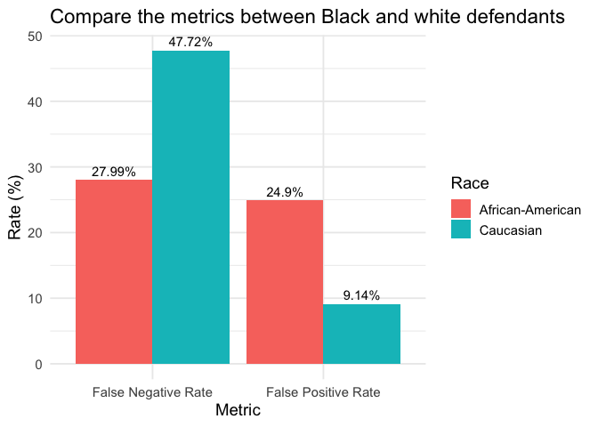
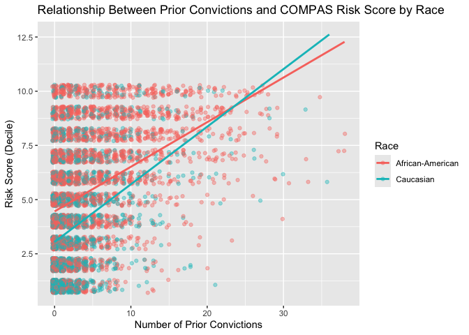
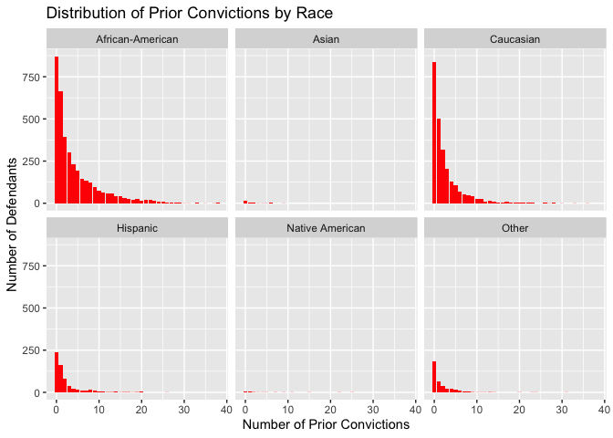

Lab 09: Algorithmic Bias
================
Allison Li
20250407

## Load Packages and Data

First, let’s load the necessary packages:

``` r
##install.packages('ggpubr')
##install.packages('janitor')

library(tidyverse)
library(fairness)
library(ggplot2)
library(janitor)
library(ggpubr)
```

### The data

For this lab, we’ll use the COMPAS dataset compiled by ProPublica. The
data has been preprocessed and cleaned for you. You’ll have to load it
yourself. The dataset is available in the `data` folder, but I’ve
changed the file name from `compas-scores-two-years.csv` to
`compas-scores-2-years.csv`. I’ve done this help you practice debugging
code when you encounter an error.

``` r
compas <- read_csv("data/compas-scores-2-years.csv")%>%
  clean_names() %>% 
  rename(decile_score = decile_score_12,
         priors_count = priors_count_15)
```

    ## New names:
    ## Rows: 7214 Columns: 53
    ## ── Column specification
    ## ──────────────────────────────────────────────────────── Delimiter: "," chr
    ## (19): name, first, last, sex, age_cat, race, c_case_number, c_charge_de... dbl
    ## (19): id, age, juv_fel_count, decile_score...12, juv_misd_count, juv_ot... lgl
    ## (1): violent_recid dttm (2): c_jail_in, c_jail_out date (12):
    ## compas_screening_date, dob, c_offense_date, c_arrest_date, r_offe...
    ## ℹ Use `spec()` to retrieve the full column specification for this data. ℹ
    ## Specify the column types or set `show_col_types = FALSE` to quiet this message.
    ## • `decile_score` -> `decile_score...12`
    ## • `priors_count` -> `priors_count...15`
    ## • `decile_score` -> `decile_score...40`
    ## • `priors_count` -> `priors_count...49`

``` r
# Take a look at the data
glimpse(compas)
```

    ## Rows: 7,214
    ## Columns: 53
    ## $ id                      <dbl> 1, 3, 4, 5, 6, 7, 8, 9, 10, 13, 14, 15, 16, 18…
    ## $ name                    <chr> "miguel hernandez", "kevon dixon", "ed philo",…
    ## $ first                   <chr> "miguel", "kevon", "ed", "marcu", "bouthy", "m…
    ## $ last                    <chr> "hernandez", "dixon", "philo", "brown", "pierr…
    ## $ compas_screening_date   <date> 2013-08-14, 2013-01-27, 2013-04-14, 2013-01-1…
    ## $ sex                     <chr> "Male", "Male", "Male", "Male", "Male", "Male"…
    ## $ dob                     <date> 1947-04-18, 1982-01-22, 1991-05-14, 1993-01-2…
    ## $ age                     <dbl> 69, 34, 24, 23, 43, 44, 41, 43, 39, 21, 27, 23…
    ## $ age_cat                 <chr> "Greater than 45", "25 - 45", "Less than 25", …
    ## $ race                    <chr> "Other", "African-American", "African-American…
    ## $ juv_fel_count           <dbl> 0, 0, 0, 0, 0, 0, 0, 0, 0, 0, 0, 0, 0, 0, 0, 0…
    ## $ decile_score            <dbl> 1, 3, 4, 8, 1, 1, 6, 4, 1, 3, 4, 6, 1, 4, 1, 3…
    ## $ juv_misd_count          <dbl> 0, 0, 0, 1, 0, 0, 0, 0, 0, 0, 0, 0, 0, 0, 0, 0…
    ## $ juv_other_count         <dbl> 0, 0, 1, 0, 0, 0, 0, 0, 0, 0, 0, 0, 0, 0, 0, 0…
    ## $ priors_count            <dbl> 0, 0, 4, 1, 2, 0, 14, 3, 0, 1, 0, 3, 0, 0, 1, …
    ## $ days_b_screening_arrest <dbl> -1, -1, -1, NA, NA, 0, -1, -1, -1, 428, -1, 0,…
    ## $ c_jail_in               <dttm> 2013-08-13 06:03:42, 2013-01-26 03:45:27, 201…
    ## $ c_jail_out              <dttm> 2013-08-14 05:41:20, 2013-02-05 05:36:53, 201…
    ## $ c_case_number           <chr> "13011352CF10A", "13001275CF10A", "13005330CF1…
    ## $ c_offense_date          <date> 2013-08-13, 2013-01-26, 2013-04-13, 2013-01-1…
    ## $ c_arrest_date           <date> NA, NA, NA, NA, 2013-01-09, NA, NA, 2013-08-2…
    ## $ c_days_from_compas      <dbl> 1, 1, 1, 1, 76, 0, 1, 1, 1, 308, 1, 0, 0, 1, 4…
    ## $ c_charge_degree         <chr> "F", "F", "F", "F", "F", "M", "F", "F", "M", "…
    ## $ c_charge_desc           <chr> "Aggravated Assault w/Firearm", "Felony Batter…
    ## $ is_recid                <dbl> 0, 1, 1, 0, 0, 0, 1, 0, 0, 1, 0, 1, 0, 0, 1, 1…
    ## $ r_case_number           <chr> NA, "13009779CF10A", "13011511MM10A", NA, NA, …
    ## $ r_charge_degree         <chr> NA, "(F3)", "(M1)", NA, NA, NA, "(F2)", NA, NA…
    ## $ r_days_from_arrest      <dbl> NA, NA, 0, NA, NA, NA, 0, NA, NA, 0, NA, NA, N…
    ## $ r_offense_date          <date> NA, 2013-07-05, 2013-06-16, NA, NA, NA, 2014-…
    ## $ r_charge_desc           <chr> NA, "Felony Battery (Dom Strang)", "Driving Un…
    ## $ r_jail_in               <date> NA, NA, 2013-06-16, NA, NA, NA, 2014-03-31, N…
    ## $ r_jail_out              <date> NA, NA, 2013-06-16, NA, NA, NA, 2014-04-18, N…
    ## $ violent_recid           <lgl> NA, NA, NA, NA, NA, NA, NA, NA, NA, NA, NA, NA…
    ## $ is_violent_recid        <dbl> 0, 1, 0, 0, 0, 0, 0, 0, 0, 1, 0, 0, 0, 0, 0, 0…
    ## $ vr_case_number          <chr> NA, "13009779CF10A", NA, NA, NA, NA, NA, NA, N…
    ## $ vr_charge_degree        <chr> NA, "(F3)", NA, NA, NA, NA, NA, NA, NA, "(F2)"…
    ## $ vr_offense_date         <date> NA, 2013-07-05, NA, NA, NA, NA, NA, NA, NA, 2…
    ## $ vr_charge_desc          <chr> NA, "Felony Battery (Dom Strang)", NA, NA, NA,…
    ## $ type_of_assessment      <chr> "Risk of Recidivism", "Risk of Recidivism", "R…
    ## $ decile_score_40         <dbl> 1, 3, 4, 8, 1, 1, 6, 4, 1, 3, 4, 6, 1, 4, 1, 3…
    ## $ score_text              <chr> "Low", "Low", "Low", "High", "Low", "Low", "Me…
    ## $ screening_date          <date> 2013-08-14, 2013-01-27, 2013-04-14, 2013-01-1…
    ## $ v_type_of_assessment    <chr> "Risk of Violence", "Risk of Violence", "Risk …
    ## $ v_decile_score          <dbl> 1, 1, 3, 6, 1, 1, 2, 3, 1, 5, 4, 4, 1, 2, 1, 2…
    ## $ v_score_text            <chr> "Low", "Low", "Low", "Medium", "Low", "Low", "…
    ## $ v_screening_date        <date> 2013-08-14, 2013-01-27, 2013-04-14, 2013-01-1…
    ## $ in_custody              <date> 2014-07-07, 2013-01-26, 2013-06-16, NA, NA, 2…
    ## $ out_custody             <date> 2014-07-14, 2013-02-05, 2013-06-16, NA, NA, 2…
    ## $ priors_count_49         <dbl> 0, 0, 4, 1, 2, 0, 14, 3, 0, 1, 0, 3, 0, 0, 1, …
    ## $ start                   <dbl> 0, 9, 0, 0, 0, 1, 5, 0, 2, 0, 0, 4, 1, 0, 0, 0…
    ## $ end                     <dbl> 327, 159, 63, 1174, 1102, 853, 40, 265, 747, 4…
    ## $ event                   <dbl> 0, 1, 0, 0, 0, 0, 1, 0, 0, 1, 0, 1, 0, 0, 1, 1…
    ## $ two_year_recid          <dbl> 0, 1, 1, 0, 0, 0, 1, 0, 0, 1, 0, 1, 0, 0, 1, 1…

## Exercise 1

The COMPAS dataset has 7214 variables and 53 data/person. Each row in
this dataset represents a person that was arrested, and each row
represents the information collected about that person, mostly their
demographic information and their prison or arrested information.

## Exercise 2

``` r
## I will try to examine if all the columns are unique defendants by looking at the names, age, and sex variables. If there are two people with same names, age, and sex, I will take a further look and see if they are actually the same person or not.
repeated_people <- compas %>%
  group_by(name, sex, age) %>%  # dob = date of birth if available
  filter(n() > 1)
print(repeated_people)
```

    ## # A tibble: 2 × 53
    ## # Groups:   name, sex, age [1]
    ##      id name    first last  compas_screening_date sex   dob          age age_cat
    ##   <dbl> <chr>   <chr> <chr> <date>                <chr> <date>     <dbl> <chr>  
    ## 1  3492 roderi… rode… thom… 2014-03-10            Male  1993-01-07    23 Less t…
    ## 2  7477 roderi… rode… thom… 2013-02-12            Male  1992-05-28    23 Less t…
    ## # ℹ 44 more variables: race <chr>, juv_fel_count <dbl>, decile_score <dbl>,
    ## #   juv_misd_count <dbl>, juv_other_count <dbl>, priors_count <dbl>,
    ## #   days_b_screening_arrest <dbl>, c_jail_in <dttm>, c_jail_out <dttm>,
    ## #   c_case_number <chr>, c_offense_date <date>, c_arrest_date <date>,
    ## #   c_days_from_compas <dbl>, c_charge_degree <chr>, c_charge_desc <chr>,
    ## #   is_recid <dbl>, r_case_number <chr>, r_charge_degree <chr>,
    ## #   r_days_from_arrest <dbl>, r_offense_date <date>, r_charge_desc <chr>, …

``` r
## I only found two people with same age, sex, and names. After looking at their other information, such as DOB, I knew that they were not the same person. 
## So in general, there is no repeated data, so the number of unique defendants are the same as the number of rows.
```

## Exercise 3

``` r
ggplot(compas, aes(x = decile_score)) +
  geom_histogram(binwidth = 1, color = "black", fill = "pink") +
  labs(
    title = "Distribution of COMPAS Risk Scores",
    x = "Decile Score",
    y = "Number of Defendants"
  ) 
```

<!-- -->

According to the graph, the distribution is right skewed, suggesting
that most people in the dataset have a low risk score.

## Exercise 3

``` r
## race
compas_race <- compas %>%
  mutate(
    race = case_when(
      race == "African-American" ~ 6,
      race == "Asian" ~ 5,
      race == "Caucasian" ~ 4,
      race == "Hispanic" ~ 3,
      race == "Native American" ~ 2,
      race == "Other" ~ 1
    )
  )

ggplot(compas_race, aes(x = race)) +
  geom_histogram(binwidth = 1, color = "orange", fill = "tomato") + ##tomato loll
  labs(
    title = "Distribution of Defendants' Race",
    x = "Race/Ethnicity",
    y = "Number of Defendants"
  ) 
```

<!-- -->

``` r
## sex
compas_sex <- compas %>%
  mutate(
    sex = case_when(
      sex == "Male" ~ 2,
      sex == "Female" ~ 1
    )
  )

ggplot(compas_sex, aes(x = sex)) +
  geom_histogram(binwidth = 1, color = "lightblue", fill = "pink") + 
  labs(
    title = "Distribution of Defendants' Sex",
    x = "Sex",
    y = "Number of Defendants"
  ) 
```

<!-- -->

``` r
## age
compas_age <- compas %>%
  mutate(
    age_cat = case_when(
      age_cat == "25 - 45" ~ 2,
      age_cat == "Greater than 45" ~ 3,
      age_cat == "Less than 25" ~ 1
    )
  )

ggplot(compas_age, aes(x = age_cat)) +
  geom_histogram(binwidth = 1, color = "yellow", fill = "lightgreen") +
  labs(
    title = "Distribution of Defendants' Age Period",
    x = "Age Category",
    y = "Number of Defendants"
  ) 
```

<!-- -->

``` r
##extra challenge
compas_three <- compas %>%
  mutate(
    race = case_when(
      race == "African-American" ~ 6,
      race == "Asian" ~ 5,
      race == "Caucasian" ~ 4,
      race == "Hispanic" ~ 3,
      race == "Native American" ~ 2,
      race == "Other" ~ 1),
      sex = case_when(
      sex == "Male" ~ 2,
      sex == "Female" ~ 1),
    age_cat = case_when(
      age_cat == "25 - 45" ~ 2,
      age_cat == "Greater than 45" ~ 3,
      age_cat == "Less than 25" ~ 1
    ))

compas_three <- compas_three %>%
  select(race, sex, age_cat) %>%
  pivot_longer(cols = everything(), names_to = "demographic", values_to = "category") ##I asked GPT for help for this step.

ggplot(compas_three, aes(x = category, fill = demographic)) +
  geom_bar(position = "dodge", color = "yellow") +
  facet_wrap(~ demographic, scales = "free_x") +
  scale_fill_manual(values = c(
    "race" = "tomato",
    "sex" = "lightpink",
    "age_cat" = "lightgreen"
  )) +
  labs(
    title = "Demographic Distributions: Race, Sex, and Age Category",
    x = "",
    y = "Count"
  ) +
  theme(axis.text.x = element_text(angle = 45, hjust = 1))
```

<!-- -->

## Exercise 5

``` r
ggplot(compas, aes(x = decile_score, y = two_year_recid)) +
  geom_smooth(method = "lm", formula = y ~ x, color = "blue") +
  stat_cor(method = "pearson", label.x = 2, label.y = 1) +
  theme_bw() +
  labs(
    x = "Two-Year Recidivism (0 = No, 1 = Yes)",
    y = "Risk Scores",
    title = "Relationship Between Risk Scores and Actual Recidivism"
  )
```

<!-- -->

According to the graph, it shows that there is a positive correlation
between two year recidivism and risk scores. This relationship suggests
that higher risk score is actually related with higher rates of
recidivism.

## Exercise 6

``` r
compas_accuracy <- compas %>%
  mutate(
    correct_prediction = case_when(
      decile_score >= 7 & two_year_recid == 1 ~ 1,
      decile_score <= 4 & two_year_recid == 0 ~ 1,
      TRUE ~ 0
    )
  )

accuracy <- mean(compas_accuracy$correct_prediction)
print(paste("Overall accuracy of COMPAS:", round(accuracy * 100, 2), "%"))
```

    ## [1] "Overall accuracy of COMPAS: 55.89 %"

## Exercise 7

According to the actual correlation and the prediction between the risk
scores and actual recidivism, the relationship of the actual one is
moderate and less strong than the prediction. The results suggest that
while the COMPAS algorithm shows some predictive ability, it does not
seem to align well with the actual correlation.

# Part 3

## Exercise 8

``` r
filtered_data <- compas %>%
  filter(race %in% c("African-American", "Caucasian"))

score_distribution <- filtered_data %>%
  group_by(race, decile_score) %>%
  summarise(count = n(), .groups = "drop")

ggplot(score_distribution, aes(x = decile_score, y = count, color = race)) +
  geom_line(size = 1) +
  geom_point(size = 1.2) +
  labs(
    title = "Relationship Between Risk Scores and Actual Recidivism",
    x = "Decile Score",
    y = "Number of Defendants",
    color = "Race"
  ) 
```

    ## Warning: Using `size` aesthetic for lines was deprecated in ggplot2 3.4.0.
    ## ℹ Please use `linewidth` instead.
    ## This warning is displayed once every 8 hours.
    ## Call `lifecycle::last_lifecycle_warnings()` to see where this warning was
    ## generated.

<!-- -->

There is a notable difference between black and white defendants, that
the line representing African-Americans was flatter, indicating that
African-American individuals were identified as having higher risk
scores more frequently than to white defendants.

## Exercise 9

``` r
highrisk_summary <- filtered_data %>%
  mutate(high_risk = decile_score >= 7) %>%
  group_by(race) %>%
  summarise(
    total = n(),
    high_risk_n = sum(high_risk),
    high_risk_percent = round(100 * mean(high_risk), 2)
  )
print(highrisk_summary)
```

    ## # A tibble: 2 × 4
    ##   race             total high_risk_n high_risk_percent
    ##   <chr>            <int>       <int>             <dbl>
    ## 1 African-American  3696        1425              38.6
    ## 2 Caucasian         2454         419              17.1

According to the results, 38.56% of Black defendants were identified as
high risk, while 17.07% of White defendants were identified as high
risk, indicating that there is a more than twice larger disparity.

## Exercise 10

``` r
##False Positive Rate
non_recidivists <- compas %>%
  filter(two_year_recid == 0)%>%
  filter(race %in% c("African-American", "Caucasian")) %>%
  mutate(high_risk = decile_score >= 7) %>%
  group_by(race) %>%
  summarise(
    total_non_recidivists = n(),
    false_positives = sum(high_risk),
    false_positive_rate = round(100 * mean(high_risk), 2)
  )

##False Negative Rate
recidivists <- compas %>%
  filter(two_year_recid == 1) %>%
  filter(race %in% c("African-American", "Caucasian")) %>%
  mutate(low_risk = decile_score <= 4) %>%
  group_by(race) %>%
  summarise(
    total_recidivists = n(),
    false_negatives = sum(low_risk),
    false_negative_rate = round(100 * mean(low_risk), 2)
  )

print(non_recidivists)
```

    ## # A tibble: 2 × 4
    ##   race             total_non_recidivists false_positives false_positive_rate
    ##   <chr>                            <int>           <int>               <dbl>
    ## 1 African-American                  1795             447               24.9 
    ## 2 Caucasian                         1488             136                9.14

``` r
print(recidivists)
```

    ## # A tibble: 2 × 4
    ##   race             total_recidivists false_negatives false_negative_rate
    ##   <chr>                        <int>           <int>               <dbl>
    ## 1 African-American              1901             532                28.0
    ## 2 Caucasian                      966             461                47.7

## Exercise 11

``` r
fpr <- compas %>%
  filter(race %in% c("African-American", "Caucasian"), two_year_recid == 0) %>%
  mutate(high_risk = decile_score >= 7) %>%
  group_by(race) %>%
  summarise(rate = mean(high_risk), .groups = "drop") %>%
  mutate(metric = "False Positive Rate")
fnr <- compas %>%
  filter(race %in% c("African-American", "Caucasian"), two_year_recid == 1) %>%
  mutate(low_risk = decile_score <= 4) %>%
  group_by(race) %>%
  summarise(rate = mean(low_risk), .groups = "drop") %>%
  mutate(metric = "False Negative Rate")

metrics_df <- bind_rows(fpr, fnr)

metrics_df <- metrics_df %>%
  mutate(rate_percent = round(rate * 100, 2))

##The visualization
ggplot(metrics_df, aes(x = metric, y = rate_percent, fill = race)) +
  geom_bar(stat = "identity", position = "dodge") +
  labs(
    title = "Compare the metrics between Black and white defendants",
    x = "Metric",
    y = "Rate (%)",
    fill = "Race"
  ) +
  theme_minimal(base_size = 14) +
  geom_text(aes(label = paste0(rate_percent, "%")), 
            position = position_dodge(width = 0.9), 
            vjust = -0.5)
```

<!-- -->

According to the graph, it is clear that Caucasian has a high rate in
false negative rate, suggesting that White defendants were more likely
to be viewed as not a criminal when they actually committed a crime.
This rate is low for Black individuals in the study. Additionally, the
false negative rate is higher for African-American people, suggesting
that Black defendants were more likely to be considered as a criminal
when they in fact did not committed a crime.

# Part 4

## Exercise 12

``` r
filtered_data <- compas %>%
  filter(race %in% c("African-American", "Caucasian"))

ggplot(filtered_data, aes(x = priors_count, y = decile_score, color = race)) +
  geom_jitter(alpha = 0.4, width = 0.3, height = 0.3) + 
  geom_smooth(method = "lm", se = FALSE, size = 1) +  
  labs(
    title = "Relationship Between Prior Convictions and COMPAS Risk Score by Race",
    x = "Number of Prior Convictions",
    y = "Risk Score (Decile)",
    color = "Race"
  ) 
```

    ## `geom_smooth()` using formula = 'y ~ x'

<!-- -->

In general, although both racial groups’ correlations suggested that
higher risk score was associated with more number of prior convictions,
there is a small differences between the two racial groups. It seems
that with same amount of convictions, black people were identified as
having higher risk scores than white, but the difference is small and
seemed to disappear when the number of convictions is higher.

## Exercise 13

Based on the previous analyses, I think in terms of the error rates
(false positive and false negative), there is a bias in the algorithm,
indicating that Black individuals in the dataset are more likely to be
considered as criminals when they are actually not. In terms of
calibration, the algorithm tends to view Black individuals having higher
risk scores when White and Black individuals committed the same amount
of crime. However, this difference became smaller and changed to the
opposite when the number of prior convictions become around 23. In
general, I think the algorithm is biased (if I understand the questions
and analyses correctly).

# Part 5

## Exercise 14

I would first control for the race/ethnicity of the individuals in the
dataset while creating the algorithm. More specifically, I would try to
equalize the false positive and false negative rates across racial and
gender groups. I would minimize racial disparities by ensuring that the
algorithm does not produce systematically higher scores for one group
over another. Additionally, to make it more fair, I would take the
degree of crime into account when creating the algorithm. For example,
the number of juvenile felonies should be weighted more heavily than the
number of juvenile misdemeanors.

## Exercise 15

I googled for the definition of predictive parity since I am not sure
how to answer this question, and I hope I could know more about this.
When designing a “fair” algorithm for criminal risk assessment, the
algorithm might take race as a predictor to assure the predictive
parity, which can ensure the same positive predictive value across
different social groups. This would make each racial, or even gender,
group to have unequal false positive and false negative rates across
groups.

## Exercise 16

In my opinion, the algorithmic risk assessment should not reinforce
existing inequalities and be transparent about its rules/ standards when
calculating risk factors. People, government, or institutions that are
using the algorithm should be aware of the limitations and potential
racial bias when making decisions or predictions. They should be able to
challenge the bias and willing to correct with the goal of reducing any
types of systemic biases.

# Part 6

## Exercise 17

``` r
ggplot(compas, aes(x = priors_count)) +
  geom_bar(fill = "red") +
  facet_wrap(~race) +  
  labs(
    title = "Distribution of Prior Convictions by Race",
    x = "Number of Prior Convictions",
    y = "Number of Defendants"
  )
```

<!-- -->

According to the table, African-American defendants tended to have
slightly more individuals with middle and higher numbers in prior
convictions, while Caucasian, Hispanic, and other racial groups tended
to have a decrease in number of defendants when the number of prior
convictions went higher. Additionally, since there is generally more
African American with prioro convictions in the current dataset, their
data has contributed more when calculating the risk scores (not sure if
this makes sense?).

## Exercise 18

``` r
## Charge degree
ggplot(compas, aes( x = decile_score, fill = c_charge_degree
                      ))+
  geom_histogram(stat = "count")+
  scale_fill_manual(labels = c("Felony", "Misdemeanor"), values = c("red", "blue"))+
  facet_grid(c_charge_degree ~ race, labeller = as_labeller( c(
        'African-American' = "Black",
        'Caucasian' = "White",
        'Other' = "Other",
        'Hispanic' = "Hispanic",
        'Asian' = "Asian",
        'Native American' = "Native",
        'F' = "Felony",
       'M' = "Misdemeanor"
        )))+
  labs(
    x = "Risk Scores",
    y = "Number of Defendants",
    title = "charge degree distributions across racial groups"
      )
```

    ## Warning in geom_histogram(stat = "count"): Ignoring unknown parameters:
    ## `binwidth`, `bins`, and `pad`

<!-- -->

``` r
## Age
ggplot(compas, aes( x = decile_score, fill = age_cat
                      ))+
  geom_histogram(stat = "count")+
  scale_fill_manual(values = c("pink", "lightblue","lightgreen"))+
  facet_grid(age_cat ~ race, labeller = as_labeller( c(
        'African-American' = "Black",
        'Caucasian' = "White",
        'Other' = "Other",
        'Hispanic' = "Hispanic",
        'Asian' = "Asian",
        'Native American' = "Native",
        'Less than 25' = "< 25",
        '25 - 45' = "25 - 45",
     'Greater than 45' = "> 45"
        )))+
  labs(
    x = "Risk Scores",
    y = "Number of Defendants",
    title = "age category distributions across racial groups"
      )
```

    ## Warning in geom_histogram(stat = "count"): Ignoring unknown parameters:
    ## `binwidth`, `bins`, and `pad`

<!-- -->

According to the graph of charge degree, the distribution of
African-American group is different from the White, Hispanic, and Other
groups (the Native and Asian American groups had too little data to
notice a pattern of distribution). Black group showed a even amount of
number in prior convictions while the rest racial groups had decrease in
number of prior convictions along with risk scores. It seems like that
Black defendants, despite of charge degree type, are more likely to
receive higher risk scores than white defendants with similar charges.
This distribution shows that the algorithm might be more likely to
assign Black individual with higher scores when they committed either
felony or misdemeanor crimes, comparing with other racial groups. For
the age graph, it seems like most of the convictions were committed by
individuals from 25 to 45. This variable also showed different
distribution across racial groups, particularly during 25 to 45 year
old. It seems to suggest that African-American individuals in the
dataset were assigned with having higher risk scores across different
age groups.

## Exercise 19

``` r
# Create a logistic regression model
recid_model <- glm(
  two_year_recid ~ age + priors_count + c_charge_degree,
  data = compas,
  family = binomial()
)

# Add predicted probabilities to the dataset
compas_new <- compas %>%
  mutate(
    predicted_prob = predict(recid_model, type = "response"),
    our_high_risk = predicted_prob >= 0.5
  )
```

## Exercise 20

``` r
##False Positive Rate
newnon_recidivists <- compas_new %>%
  filter(two_year_recid == 0, race %in% c("African-American", "Caucasian")) %>%
  mutate(high_risk = predicted_prob >= 0.5) %>%  # define high risk
  group_by(race) %>%
  summarise(
    total_non_recidivists = n(),
    false_positives = sum(high_risk),
    false_positive_rate = round(100 * mean(high_risk), 2)
  )

##we did not decide what is the standard for low risk, so I am not sure how to calculate the False Negative Rate. I guess low risk would just be <.33??
newrecidivists <- compas_new %>%
  filter(two_year_recid == 1, race %in% c("African-American", "Caucasian")) %>%
  mutate(low_risk = predicted_prob < 0.33) %>%  # define low risk
  group_by(race) %>%
  summarise(
    total_recidivists = n(),
    false_negatives = sum(low_risk),
    false_negative_rate = round(100 * mean(low_risk), 2)
  )

print(newnon_recidivists)
```

    ## # A tibble: 2 × 4
    ##   race             total_non_recidivists false_positives false_positive_rate
    ##   <chr>                            <int>           <int>               <dbl>
    ## 1 African-American                  1795             516                28.8
    ## 2 Caucasian                         1488             212                14.2

``` r
print(newrecidivists)
```

    ## # A tibble: 2 × 4
    ##   race             total_recidivists false_negatives false_negative_rate
    ##   <chr>                        <int>           <int>               <dbl>
    ## 1 African-American              1901             146                7.68
    ## 2 Caucasian                      966             208               21.5

``` r
newnon <- compas_new %>%
  filter(two_year_recid == 0, race %in% c("African-American", "Caucasian")) %>%
  mutate(high_risk = predicted_prob >= 0.5) %>% 
  group_by(race) %>%
  summarise(rate = mean(high_risk), .groups = "drop") %>%
  mutate(newmetric = "False Positive Rate")

newfnr <- compas_new %>%
  filter(race %in% c("African-American", "Caucasian"), two_year_recid == 1) %>%
  mutate(low_risk = predicted_prob < 0.33) %>%
  group_by(race) %>%
  summarise(rate = mean(low_risk), .groups = "drop") %>%
  mutate(newmetric = "False Negative Rate")

newmetrics <- bind_rows(newnon, newfnr)

newmetrics <- newmetrics %>%
  mutate(rate_percent = round(rate * 100, 2))

##The visualization
ggplot(newmetrics, aes(x = newmetric, y = rate_percent, fill = race)) +
  geom_bar(stat = "identity", position = "dodge") +
  labs(
    title = "metrics between Black and white defendants, new Model",
    x = "Metric",
    y = "Rate (%)",
    fill = "Race"
  ) +
  theme_minimal(base_size = 14) +
  geom_text(aes(label = paste0(rate_percent, "%")), 
            position = position_dodge(width = 0.9), 
            vjust = -0.5)
```

<!-- -->

According to the table, I believe the new algorithm is less biased, such
as that the highest rate for False Negative rate for African-American is
much smaller comparing with the COMPAS. In general, the new model is
less biased, particulalry for the false negative rates.However, the
false positive for African-American was slightly larger than COMPAS,
indicating that the model is more likely to identify African American
individuals as having high risk when they did not committed a crime.

## Exercise 21

``` r
# Create a logistic regression model with race
recid_model_with_race <- glm(
  two_year_recid ~ age + priors_count + c_charge_degree + race,
  data = compas,
  family = binomial()
)

# Add predicted probabilities to the dataset
compas_race <- compas %>%
  mutate(
    predicted_prob_with_race = predict(recid_model_with_race, type = "response"),
    race_high_risk = predicted_prob_with_race >= 0.5
  )
```

## Exercise 22

``` r
nfpr <- compas_race %>%
  filter(two_year_recid == 0, race %in% c("African-American", "Caucasian")) %>%
  mutate(high_risk = predicted_prob_with_race >= 0.5) %>% 
  group_by(race) %>%
  summarise(rate = mean(high_risk), .groups = "drop") %>%
  mutate(nmetric = "False Positive Rate")

nfnr <- compas_race %>%
  filter(race %in% c("African-American", "Caucasian"), two_year_recid == 1) %>%
  mutate(low_risk = predicted_prob_with_race < 0.33) %>%
  group_by(race) %>%
  summarise(rate = mean(low_risk), .groups = "drop") %>%
  mutate(nmetric = "False Negative Rate")

nmetrics <- bind_rows(nfpr, nfnr)

nmetrics <- nmetrics %>%
  mutate(rate_percent = round(rate * 100, 2))

##The visualization
ggplot(nmetrics, aes(x = nmetric, y = rate_percent, fill = race)) +
  geom_bar(stat = "identity", position = "dodge") +
  labs(
    title = "metrics between Black and white defendants, new Model",
    x = "Metric",
    y = "Rate (%)",
    fill = "Race"
  ) +
  theme_minimal(base_size = 14) +
  geom_text(aes(label = paste0(rate_percent, "%")), 
            position = position_dodge(width = 0.9), 
            vjust = -0.5)
```

<!-- -->

The false positive rate for Black defendants increased by over 4%, while
the white FPR stayed the same. Additionally, the difference in false
negatives between groups was still large, suggesting white recidivists
were still more likely to be wrongly classified as low risk. Therefore,
I speculate that adding race as a variable in this model makes it less
fair.

\##Exercise 23 I believe algorithm like COMPAS can be used, but has to
be used with caution. It should only serve as a reference point for
predicting or making decisions about criminal risk scores. Although we
have tried three types of algorithms, there is still relatively high
false positive and false negative rates, which should be clearly claimed
and understood to all the people who is using the model. This also
highlights the importance of transparency, that the algorithms to all
people.
